<div align="center">


# Mangasurf

**Download manga, manhwa and manhua from 32+ sites — and read them, in a desktop manga reader with 3D Depth Carousel, Foliate-js engine, full-screen TUI, phone server and OPDS catalog.**

**[Command syntax reference -> SYNTAX.md](MD/SYNTAX.md) • [Live Documentation Website](https://compromisee.github.io/mangasurf/)**

[](https://github.com/Compromisee/mangasurf/releases)
[](https://github.com/Compromisee/mangasurf/actions/workflows/release.yml)
[](https://github.com/Compromisee/mangasurf/actions/workflows/ci.yml)
[](https://python.org)
[](https://pywebview.flowrl.com)
[](LICENSE)

<br>

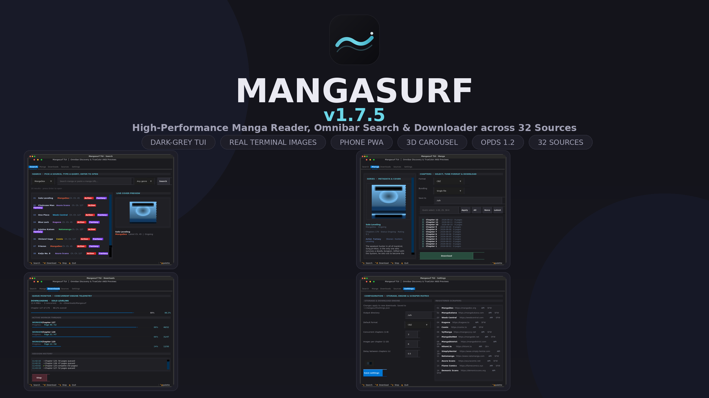

</div>

---

## Highlights & Features

### Smart Omnibar & Fast Search
- **Instant URL Detection**: Paste any chapter or series link from supported sites to immediately load chapters and metadata.
- **Source Direct Routing**: Target a specific source directly with `@source query` or `source: query` (e.g. `@kagane solo leveling`, `@weebcentral bleach`, `mangakatana: naruto`).
- **Tag Prefix Filtering**: Search by genre tags using `#action #isekai` syntax directly inside the search bar.
- **Fast Concurrent Multi-Source Engine**: High-speed parallel searching across all enabled sources using an optimized worker thread pool.
- **Result Deduplication & Interleaving**: Merge identical titles across sources and round-robin browse results.

### Source Toggling & Management
- **Enable / Disable Switches**: Easily toggle individual manga sources on or off in Settings or the Search Header.
- **Granular Controls**: Turn off discovery browsing for specific sources while keeping direct search enabled, or vice versa.
- **Priority Reordering**: Drag-and-drop or ranking adjustments so your favorite sources always appear first in merged results.
- **Politeness & Rate Limit Controls**: Configure per-source request delays, retries, and result limits.
- **Safe Mode**: Toggle adult-exclusive sources on or off with one switch.

### Advanced Genre Search & Discovery
- **Multi-Source Genre Aggregation**: Automatically aggregates and normalizes genres from all active sources.
- **Multi-Select Chip Filter**: Select multiple genres simultaneously.
- **Match Modes**: Filter by *Match All (AND)* to find titles matching every selected genre, or *Match Any (OR)*.
- **Flexible Sorting**: Sort discovery feeds by *Trending*, *Popularity*, *Latest Updates*, *Top Rated*, or *Alphabetical*.

### Optimized High-Speed Downloader
- **Multi-Threaded Architecture**: Independent chapter workers and image download threads for blazing fast downloads.
- **Atomic File Writing**: Streams to temporary `.part` files and renames upon full validation to prevent corruption.
- **Multiple Export Formats**: CBZ, PDF, EPUB, or raw image folders with customizable naming schemes.
- **Hotlink & CDN Support**: Automated referer routing, magic-byte image validation, and Cloudflare challenge fallback via FlareSolverr.

### Built-in Foliate Reader
- **Smooth Page Scrolling & Webtoon View**: Full vertical strip, single-page, double-page spread, and continuous reading modes.
- **Reading Progress Tracking**: Automatic bookmarking, reading history, streaks, and reading time statistics.
- **Customizable Themes**: Midnight, Dark, Light, Mocha, OLED Black, and Slate with accent color pickers.
- **Passcode-Protected Shelves**: Organize titles into folders and optionally lock private shelves with passcodes.

### Custom Scrapers & `.source` Plugin Engine
- Declarative `.source` plugin architecture in `mangasurf/sources/customsources/`.
- Full specification documented in [`mangasurf/sources/customsources/syntax.source`](mangasurf/sources/customsources/syntax.source).
- Define custom scraper endpoints, CSS/JSON selectors, page extractors, headers, and rate limits without touching core code.

---

## Supported Sources

| Source | Site | Notes |
| :--- | :--- | :--- |
| `mangadex` | `https://mangadex.org` | MangaDex v5 API, multilingual |
| `mangakatana` | `https://mangakatana.com` | HTML scraping, `var thzq` JS array parser |
| `weebcentral` | `https://weebcentral.com` | Long strip image scraping, Cloudflare support |
| `kagane` | `https://kagane.to` | Kagane v2 REST API |
| `comix` | `https://comix.to` | Comix v2 API, Comick support |
| `vymanga` | `https://vymanga.co` | Adult warning bypass, vertical reader |
| `mangadotnet` | `https://mangadot.net` | Nuxt API unpacker |
| `natomanga` | `https://natomanga.com` | Multi-chapter scraper |
| `asurascans` | `https://asuracomic.net` | Wp-Manga scraper |
| `flamecomics` | `https://flamecomics.xyz` | Direct reader scraper |
| `demonicscans` | `https://demonicscans.org` | Full catalog scraper |
| `madarascans` | `https://madarascans.com` | Madara core scraper |
| `omegascans` | `https://omegascans.org` | Fast catalog scraper |
| `manhwaread` | `https://manhwaread.com` | Manhwa catalog scraper |
| `madaranet` | `https://toonily.com` | Madara aggregator (10 sites in one) |
| `witchscans` | `https://witchscans.com` | High-res reader scraper |
| `writerscans` | `https://writerscans.com` | Scanlation scraper |
| `webtoons` | `https://webtoons.com` | Official Webtoons scraper |
| `mangadass` | `https://mangadass.com` | Adult 18+ aggregator |
| `manhwa18` | `https://manhwa18.net` | Adult 18+ Manhwa scraper |
| `manga18club` | `https://manga18.club` | Adult 18+ Manga scraper |
| `hentaiakane` | `https://hentaiakane.com` | Doujinshi scraper |
| `nhentai` | `https://nhentai.net` | Gallery scraper |

---

## Installation & Quick Start

### 1. Prerequisites
- Python 3.9 or higher

### 2. Clone & Install Dependencies
```bash
git clone https://github.com/your-repo/Mangasurf.git
cd Mangasurf
pip install -r requirements.txt
```

### 3. Launch Mangasurf GUI
```bash
# Launch desktop GUI
python gui.py

# Or launcher window (see landing.py)
python launcher.py

# Start mobile LAN server (see server.py)
python server.py

# Start OPDS catalog server (see opdsserve.py)
python opdsserve.py
```

---

## Interface Gallery

| View | Screenshot |
| :--- | :--- |
| **Library Grid** | 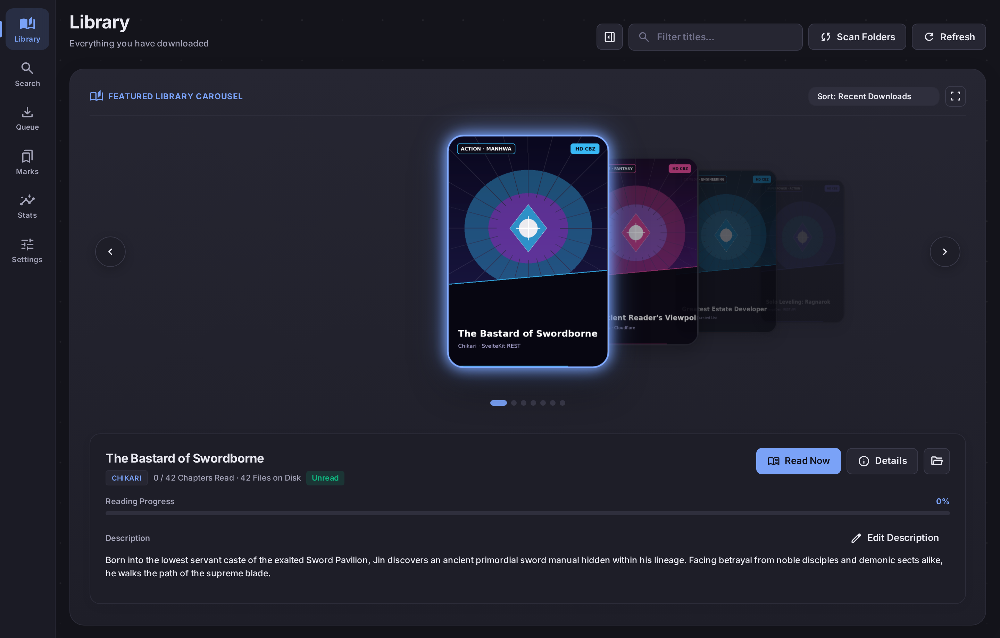 |
| **Search & Discovery** | 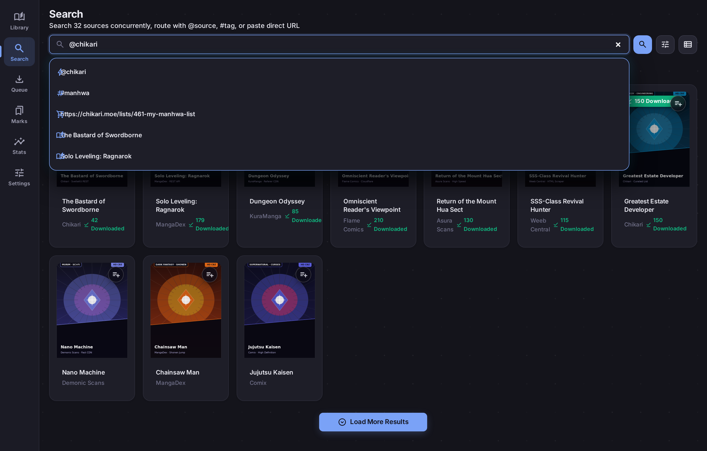 |
| **Reader View** | 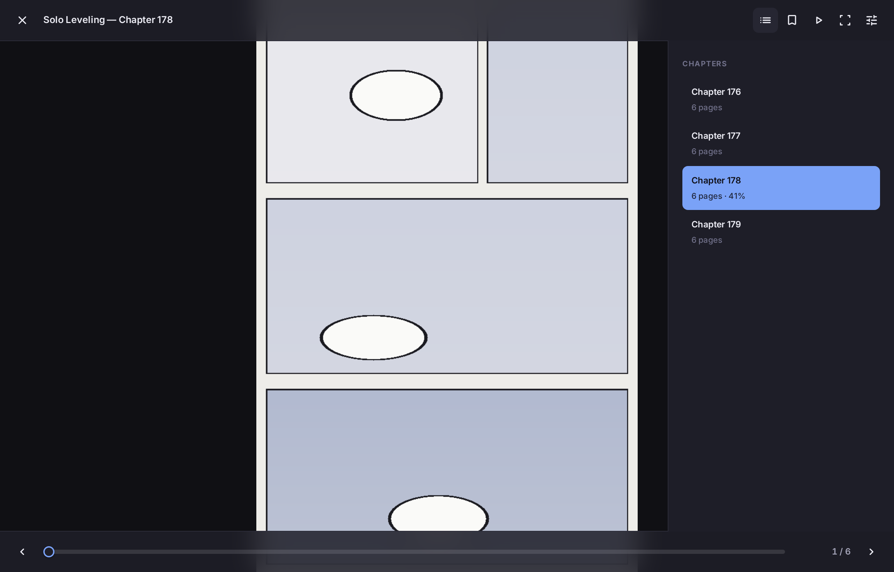 |
| **Light Theme** | 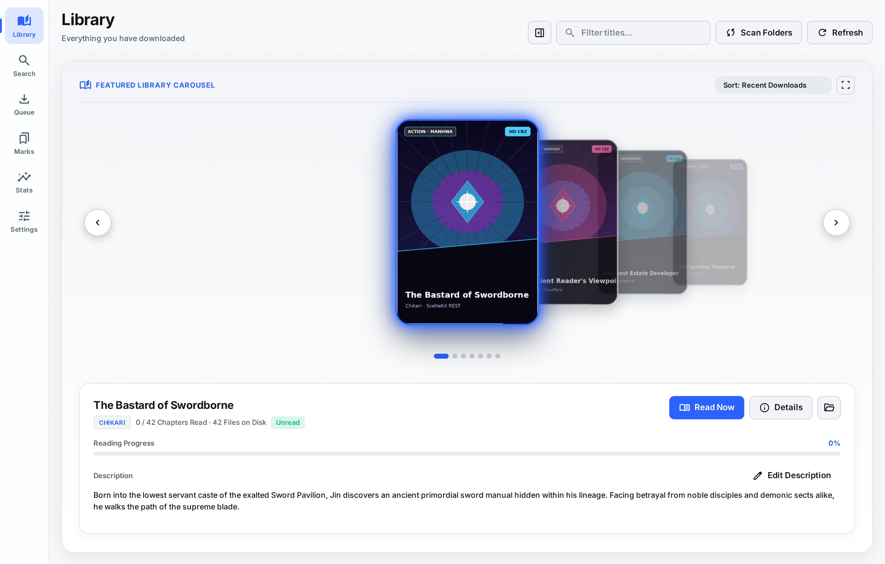 |
| **Download Queue** | 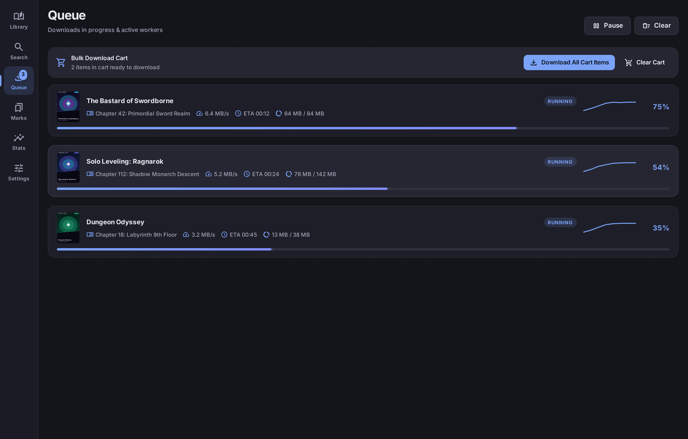 |
| **Reading Insights** |  |
| **Reading Stats** | 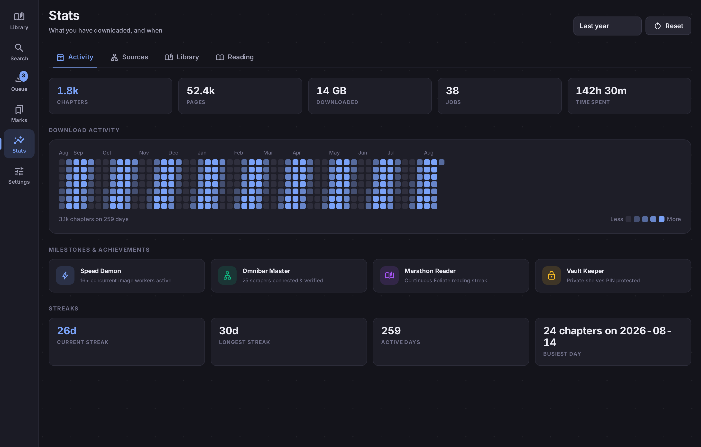 |
| **Source Manager** | 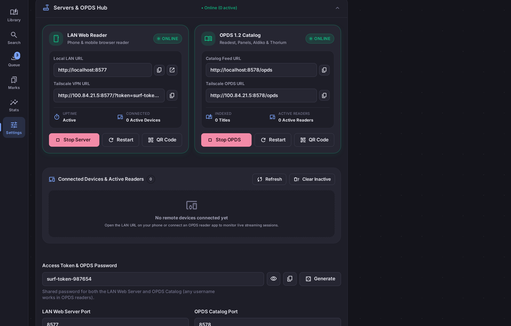 |
| **Settings Panel** | 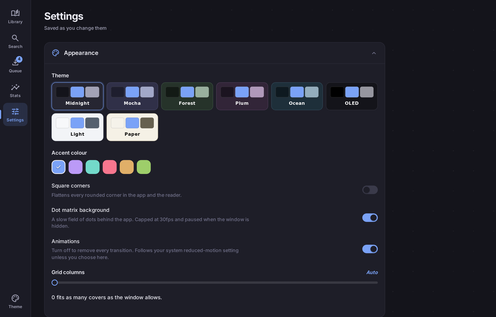 |
| **Library Tools** |  |
| **TUI Search** | 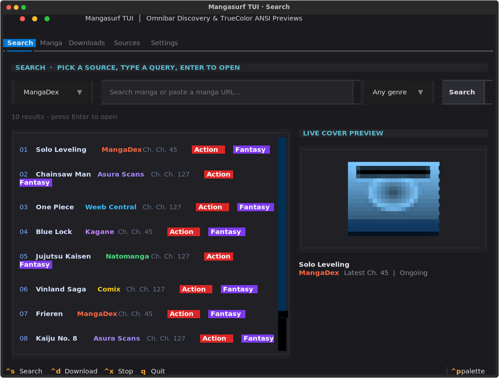 |
| **TUI Manga** | 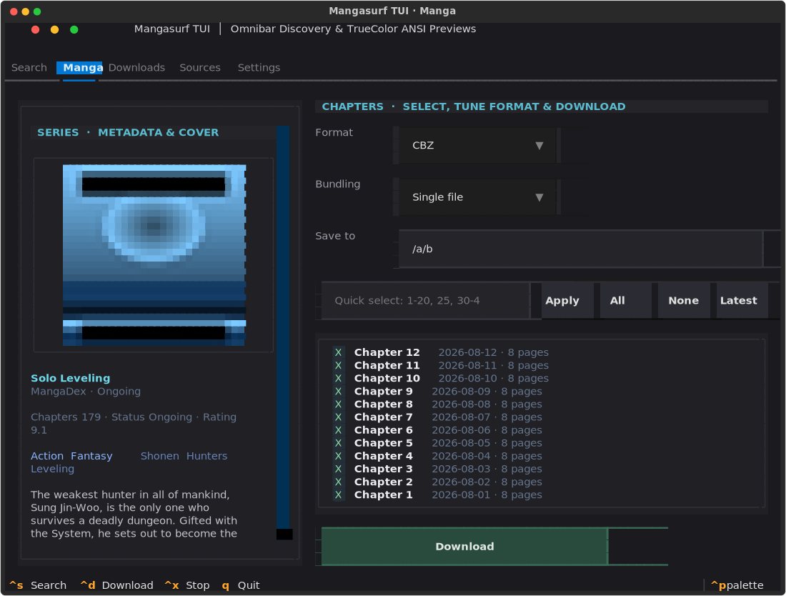 |
| **TUI Downloads** | 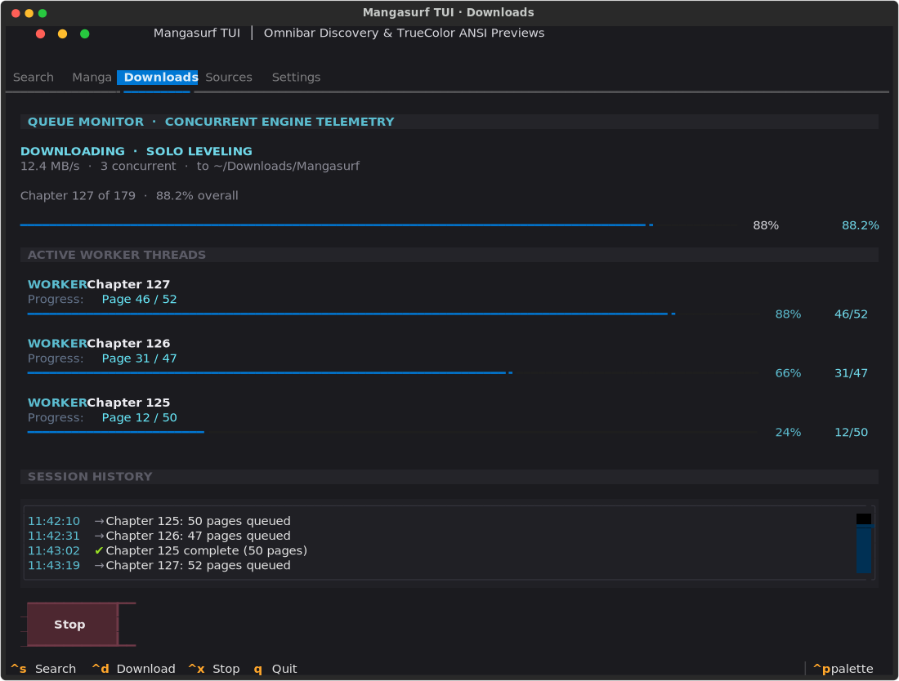 |
| **TUI Settings** | 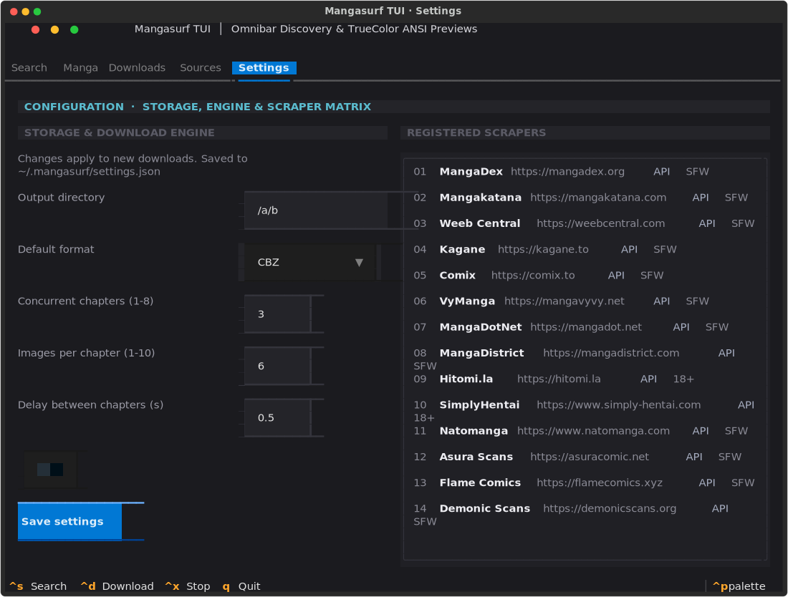 |

---

## License
This project is licensed under the [MIT License](LICENSE).
