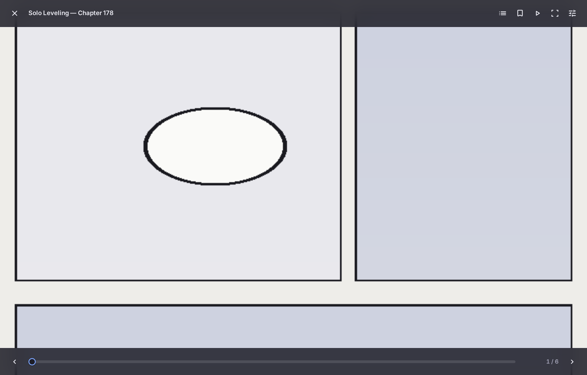

<div align="center">

# ReaderM

**Download manga, manhwa and manhua from 28 sites — and read them, in a manga reader forked from [Foliate](https://github.com/johnfactotum/foliate-js). CLI, interactive menu, full-screen TUI, desktop reader, phone server and OPDS catalog.**

[Project landing page](https://compromisee.github.io/WeebDL/) (GitHub Pages, served from `docs/`)

**[Command syntax reference -> SYNTAX.md](MD/SYNTAX.md)**

[](https://python.org)
[](https://pywebview.flowrl.com)
[](LICENSE)

<br>



</div>

---

## Highlights

### New in 1.0

- **Shelves for your library.** Folders with tags, pinning and optional
  passcode locks, shown as a tree beside the grid. Folders start collapsed;
  a locked shelf shows a padlock and a count of what it is hiding, and its
  titles are never sent to the page at all — the lock is enforced in Python
  across the grid, the continue-reading row *and* opening by path.
- **Rebindable shortcuts.** Every action in one list, with a mapping page in
  Settings, conflict detection, and four presets (ReaderM, Vim hjkl, WASD,
  one-hand). The help sheet is generated from the same list, so it can no
  longer advertise a key that does nothing.
- **Read on your phone.** Pages and packaged books stream from the host over
  the LAN with byte ranges, so a big CBZ opens without downloading it whole
  first. Only files you have opened are reachable, and a locked shelf is not.
- **A local API for other programs.** `GET /local/info` and friends describe
  the install — paths, books, positions, covers, sources, shelves, stats —
  read only, so nothing can damage a library through it. Also offline via
  `readerm api books`. Written up for agents in
  **[MD/AGENT.md](MD/AGENT.md)**.
- **Its own window frame.** A themed titlebar with minimise, maximise and
  close, instead of an OS-coloured strip above a dark app. Turn
  `custom_titlebar` off to get the native frame back.
- **Real HeroUI.** The sliders, selects, tabs and switches are
  [HeroUI](https://heroui.com/) components, bundled statically — Node is a
  build-time tool, and nothing at runtime needs it.
- **A progress bar that tells the truth.** It counts pages, not scroll
  pixels, so it no longer drifts backwards while a chapter loads and a
  finished chapter reads 100% rather than 89%.

### Everything else

- **19 sources, one tool.** MangaDex and Asura Scans through their JSON APIs, Flame Comics through its Next.js payload, and the rest scraped — manga, manhwa and manhua. One of them, the Madara adapter, covers a whole family of sites, which is how nineteen sources reach 28 of them. The right source is detected from the URL you paste — no flags required. See [Sources](#sources).
- **Search everything at once.** One query fans out across every site in parallel and merges the results, each tagged with where it came from.
- **Press Search with an empty box** and you get trending titles instead of nothing — the app opens on a discovery feed rather than a blank page.
- **Browse by genre.** 200+ genres merged across sites, with quick-pick chips, genre-filtered search and per-genre trending.
- **Smart search for covers.** One button scans a whole folder, searches every source and picks each cover itself using your source ranking — exact title first, then your preferred site, then the largest image so it never grabs a thumbnail.
- **Rebuild missing covers.** Point *Tools → Rebuild covers* at a folder of loose CBZs: it recovers the series from each filename, offers covers from every source, and saves `cover.jpg` beside the archive — splitting mixed folders so each cover belongs to the right book.
- **One launcher for everything.** `python landing.py` — or just double-clicking the packaged `ReaderM.exe` — opens a small window listing all five interfaces — desktop app, terminal menu, TUI, CLI and the phone server — and starts whichever you pick using the project's virtual environment, so a terminal launched from a file manager does not fall back to the system Python and die with ImportError.
- **Read it in Readest.** `python opdsserve.py` publishes everything you have downloaded as a standard **OPDS catalog**, so Readest, Panels, KyBook or any other reader can browse it with covers and download straight from your PC. Turn on *Start the catalog with the app* and it comes up with the GUI.
- **No more blank shelves.** One button gives every folder of loose page images its own `cover.jpg` (or `.png`, or `.webp` — it follows the source), so file managers, Kavita, Komga and OPDS readers all show artwork.
- **Use it from your phone.** `python server.py` serves the same desktop interface over your Wi-Fi. Every scrape, download and file write happens on the host PC — the phone is only a remote control, so walking out of range does not interrupt a 300-chapter job. The access token is yours to set (Settings → Phone server, minimum 16 characters), and `python server.py --gui` gives it a small control window with a live log.
- **One window, not five.** Starting ReaderM when it is already running brings the existing window forward rather than launching another copy.
- **Runs in the background.** Turn on *Minimise to system tray* and closing the window keeps downloads going. The tray menu shows live speed, ETA, chapters remaining and what is queued — and brings the window back.
- **Skip what you already have.** Search results that are in your library can be shown normally, dimmed, or hidden. Dimmed is the default: hover one and the cover fills up to the fraction you have, with the percentage on the badge.
- **A year of activity at a glance.** The Stats tab draws a contribution calendar — one square per day, brighter the more you downloaded, tinted by the sources it came from. Hovering a day names each source as a fraction.
- **Survives a crash.** Every running job is journaled to its own file, atomically. After a power cut or a kill, ReaderM offers to resume each one and skips what is already on disk.
- **Robust by design.** A circuit breaker skips sites that are down instead of waiting for timeouts, retries use exponential backoff, and discovery listings are cached. One dead site never breaks a search.
- **One command, one CBZ.** By default the CLI downloads *every* chapter and packs them into a single `.cbz` — no flags needed.
- **Flexible bundling.** Choose one file for everything, one file per chapter, or one file per every N chapters (`--per 10`).
- **Organized output.** Everything is sorted into a per-manga folder inside your output directory. Raw page images live in a `raw/` subfolder and are cleaned up automatically after packaging (unless you keep them).
- **Three formats.** CBZ, PDF (pages sized exactly to each image), and EPUB (chapter table of contents included). Produce several at once with `--also`.
- **Three interfaces.** A rich-powered CLI, a full-screen **terminal UI (TUI)** built with Textual, and a minimalist pywebview desktop GUI.
- **Minimalist GUI.** A pywebview desktop app with a pastel-dark ambient interface: circular gradient orbs, an animated dot-matrix backdrop, 6 themes and 6 accent colors, smooth animations. Google Material Symbols only — zero emojis.
- **Library and bookmarks.** Every downloaded chapter is recorded in `~/.readerm/library.json`; already-downloaded chapters are highlighted green in the chapter list, with a "New only" selector for incremental updates. Bookmark manga you want to come back to.
- **Open in Readest.** Point Settings at your reader executable (Readest or any other) and open finished books straight from the Library — multi-part downloads list every part with its size and a Read button.
- **Custom file naming.** Templates with `{title}`, `{chapter}`, `{start}`, `{end}` placeholders control output filenames, in Settings and via CLI flags.
- **Full-featured TUI.** Search, manga details, chapter multi-select with quick ranges, format/bundling pickers, live per-chapter progress and settings — entirely in your terminal (works over SSH).
- **Modern CLI.** Built on [rich](https://github.com/Textualize/rich): download plan summary, live progress bars per chapter, search and info commands.
- **Fast and polite.** Parallel chapter and image downloads with configurable workers, adaptive backoff on rate limits.
- **Crash-proof resume.** Verified checkpoints, atomic image writes and a job journal: after a crash or outage, hit **Resume** in the GUI (or run `readerm resume`) and it continues exactly where it left off — completed chapters skipped, partial chapters finish their missing pages only.
- **File logging.** Rotating log at `~/.readerm/logs/readerm.log`, exportable from Settings.
- **Cloudflare-ready.** Falls back to [FlareSolverr](https://github.com/FlareSolverr/FlareSolverr) automatically if a site puts up a challenge.
- **Pluggable by design.** A new site is one file in `readerm/sources/` plus one line in the registry; CLI, GUI and TUI pick it up automatically.
- **Rank and exclude sources.** Drag sources into your preferred order, or switch one off to drop it from results entirely. Ranking decides which copy wins when a series exists on several sites.
- **Provider always visible.** Every manga page names the site it came from, right under the title, with a link back to the original.
- **Passcode lock.** Optional PBKDF2-hashed app passcode with auto-lock, cover blurring and a one-time recovery key.
- **Track what you read.** Per-chapter read state, progress percentages, next-unread jump, star ratings and notes.
- **Watch for new chapters.** Keep a watchlist and check every series in parallel for updates.
- **Stats, filters, queue and cleanup.** Download statistics, content filters, a persistent job queue, library import/export, duplicate-file scanning and orphan detection.

See **[FEATURES.md](MD/FEATURES.md)** for the complete feature reference and
**[CHANGELOG.md](MD/CHANGELOG.md)** for the history of every update.

---

## Installation

Requires **Python 3.9+**.

```bash
git clone https://github.com/Compromisee/ReaderM.git
cd ReaderM

# install with the GUI and TUI
pip install -e ".[all]"

# or pick: CLI only / +GUI / +TUI
pip install -e .
pip install -e ".[gui]"
pip install -e ".[tui]"
pip install -e ".[server]"   # phone server + OPDS catalog
```

Or without installing the package, just grab the dependencies:

```bash
pip install -r requirements.txt
```

> **Linux GUI note:** pywebview needs a webview engine. On Debian/Ubuntu:
> `sudo apt install python3-gi gir1.2-webkit2-4.1` (or install `pywebview[qt]`).
> Windows and macOS work out of the box.

---

## CLI usage

If installed with pip you get a `readerm` command; otherwise use `python -m readerm`.

### Download (the default action)

```bash
# Default: ALL chapters -> ONE .cbz, sorted into downloads/<Manga Title>/
readerm https://mangadex.org/title/<uuid>

# One CBZ per 10 chapters
readerm <url> --per 10

# One CBZ per chapter
readerm <url> --per 1

# Chapters 1-50 as a single PDF
readerm <url> -c 1-50 -f pdf

# Latest chapter only, EPUB, custom output dir
readerm <url> -c latest -f epub -o ~/Manga

# CBZ volumes of 25 chapters AND a PDF of everything, keep raw images
readerm <url> --per 25 --also pdf --keep-images
```

### Chapter selection (`-c / --chapters`)

| Selector      | Meaning                                |
|---------------|----------------------------------------|
| `all`         | every chapter (default)                |
| `5` / `23.5`  | a single chapter (decimals supported)  |
| `1-20`        | inclusive range                        |
| `1,5,10-20`   | any combination                        |
| `50-`         | chapter 50 to the end                  |
| `-10`         | start through chapter 10               |
| `latest`      | newest chapter                         |
| `first`       | oldest chapter                         |

### Search and info

```bash
readerm search "one piece"                # search every source at once
readerm search "one piece" -s mangadex    # search a single source
readerm sources                           # list supported sites
readerm info <url>                        # title, author, status, tags, chapter count
readerm resume                 # resume an interrupted/crashed download
readerm menu                   # interactive numbered menu (no extra deps)
readerm tui                    # full-screen terminal UI (needs Textual)
readerm gui                    # launch the desktop GUI
```

### Search syntax

```bash
# narrow by series type or status
readerm search "solo" --type manhwa       # manga | manhwa | manhua | comic | novel
readerm search "one piece" --status Ongoing

# cap and sort
readerm search "naruto" -n 5 --sort title
readerm search "berserk" --sort chapters --reverse   # sort: title|source|chapters|year

# machine-readable output, for pipes and scripts
readerm search "blue" --urls              # one URL per line
readerm search "blue" --json | jq '.[].title'

# act on a numbered result without copying a URL
readerm search "berserk" --open 1         # show details for result 1
readerm search "berserk" --download 1     # download result 1
```

`--type` is derived rather than requested: only one source accepts a type
parameter, so the type is classified from origin language and tags, with a
per-source default for single-type catalogues. Results whose type cannot be
determined are **kept** — dropping them would erase whole sources from a
filtered search.

### Interactive menu

```bash
readerm menu
```

A progressive, numbered interface — every prompt is a list you answer with a
number. `b` goes back and `q` quits from any depth, so you cannot get stranded
in a submenu, and a closed stdin exits cleanly instead of raising.

It covers search, trending, pasting a URL, the library, bookmarks, settings
(folders, formats, sources, filters) and tools. It needs nothing beyond the
base install; `readerm tui` needs Textual, which is an optional extra
(`pip install readerm[tui]`).

### All options

```
-c, --chapters SEL     chapter selection (default: all)
-o, --output DIR       output directory (default: downloads)
-f, --format FMT       cbz | pdf | epub | images (default: cbz)
    --per N            chapters per file: 0 = one file for everything (default),
                       1 = per chapter, N = every N chapters
    --also FMT         produce an additional format (repeatable)
    --keep-images      keep raw page images after packaging
-w, --workers N        concurrent chapter downloads, 1-8 (default: 3)
    --image-workers N  concurrent images per chapter, 1-10 (default: 6)
    --delay S          delay between chapters in seconds (default: 0.5)
    --name-single TPL  filename template for single-file bundles (default: {title})
    --name-chapter TPL template for per-chapter files (default: {title} - Chapter {chapter})
    --name-range TPL   template for range bundles (default: {title} - Chapters {start}-{end})
-y, --yes              skip the confirmation prompt
    --plain            plain log output (for scripts / CI)

sources:
-s, --source ID        force a source (see `readerm sources` for all 23)
                       (default: detected from the URL)
-l, --language LANG    translation language, MangaDex only (default: en)
    --scanlator NAME   preferred scanlation group, MangaDex only
    --data-saver       download compressed pages, MangaDex only
```

### Output structure

```
downloads/
└── One Piece/
    ├── cover.jpg
    ├── One Piece - Chapters 001-010.cbz
    ├── One Piece - Chapters 011-020.cbz
    ├── ...
    └── raw/                     # only if --keep-images / format=images
        ├── Chapter 1/
        │   ├── 001.jpg
        │   └── ...
        └── ...
```

---

## TUI (terminal UI)

A full-screen terminal app built with [Textual](https://textual.textualize.io) —
all the GUI's features without leaving the terminal. Works over SSH.

```bash
readerm tui        # or: readerm-tui / python -m readerm tui
```

| | |
|---|---|
|  |  |
| **Manga tab** — options + chapter multi-select | **Downloads tab** — live per-chapter bars |
|  |  |
| **Search tab** — find series, Enter to open | **Settings tab** — persisted defaults |

**TUI features**

- Four tabs: **Search / Manga / Downloads / Settings** (`F1`–`F4` to jump)
- Search ReaderM by name or paste a URL straight into the search box
- Manga panel with title, author, status, tags and description
- Chapter list with checkbox multi-select (`space` toggles), All / None / Latest buttons and a quick-range box (`1-20, 25, 30-40`)
- Format (CBZ / PDF / EPUB / images) and bundling (single file / per chapter / every N) selectors
- Live download queue: overall progress bar, per-chapter image counters, colored activity log, stop button
- Settings shared with the GUI (`~/.readerm/config.json`)

**Keyboard shortcuts**

| Key | Action |
|---|---|
| `Ctrl+S` | jump to search |
| `Ctrl+D` | start download |
| `Ctrl+X` | stop download |
| `F1`–`F4` | switch tabs |
| `Tab` / arrows | move focus |
| `q` | quit |

---

## GUI

```bash
readerm gui        # or: python gui.py
```

| | |
|---|---|
|  |  |
| **Library** — everything downloaded, with a continue-reading shelf | **Reader** — webtoon mode: continuous vertical, no gaps |
|  |  |
| **Search** — every enabled source at once, from inside the reader | **Queue** — downloads in progress, without leaving the app |
|  |  |
| **Reading options** — mode, fit, filter, theme, width, gap, spread, zoom | **Right-to-left** — paged Japanese reading order, spreads reversed |
|  |  |
| **Chapters** — jump between chapters with per-chapter progress | **Themes** — nine of them, six dark and three light |
|  |  |
| **Settings** — eight themes, six accents, square-corner mode, dot matrix | **Sources** — drag to rank, toggle, capability chips |
|  | |
| **Stats** — a year of activity, streaks, and totals by source | |

**GUI features**

- Animated hero: stylized title (gradient shine + outline), floating icon, search bar centered on screen that glides to the top when you search
- **Search filters**: sort (Best Match / Popularity / Subscribers / Recently Added / Latest Updates / Alphabet) with asc/desc order, status, type (Manga / Manhwa / Manhua / OEL) and official-only — changes re-run the search live
- Search ReaderM with cover thumbnails, or paste a series URL directly
- Full manga page: cover, author, status, tags, description, bookmark button
- Chapter list with click-to-select, **downloaded chapters highlighted green**, All / None / **New only** / Latest shortcuts and a quick-range box (`1-20, 25, 30-40`)
- Format picker (CBZ / PDF / EPUB / raw images) and bundling picker (single file / per chapter / every N chapters)
- Live download queue: overall progress, per-chapter image counters, activity log, stop button, "open folder" when done
- **Bookmarks tab** — save manga for later (`~/.readerm/bookmarks.json`)
- **Library tab** — every downloaded manga with chapter/page counts, last download time; multi-part downloads expand to show each part with its file size, a **Read** button (opens your configured reader, e.g. Readest) and missing-file detection
- **Appearance settings** — 6 themes (Midnight, Mocha, Forest, Plum, Ocean, Light), 6 accent colors, animation and dot-matrix toggles
- **Behavior settings** — output directory, default format, keep raw images, open-folder-when-done, confirm-large-downloads guard with threshold, worker counts, delays, retries per image
- **File naming settings** — templates for single-file / per-chapter / range bundles with `{title}` `{chapter}` `{start}` `{end}` placeholders and a live preview
- **Reader settings** — path to the Readest executable (or any reader); empty uses your system's default app
- Ambient design: solid pastel-dark backgrounds with drifting circular gradients and an animated dot matrix; Google Material Symbols throughout, no emojis anywhere

---

## Discovery: trending and genres

Pressing **Search with an empty box is not an error** — it is how you browse.
Every interface opens on a trending feed and lets you narrow it by genre.

```bash
readerm search                     # no query -> trending across all sources
readerm trending                   # the same thing, explicitly
readerm trending horror            # top horror right now
readerm genres                     # every genre, and which sites offer it
readerm search "blue" -g Romance   # genre-filtered search
readerm trending -s mangadex       # trending on one source only
```

In the GUI the genre dropdown and quick-pick chips sit in the filter row, and
`Load more` pages through the feed. The TUI has a genre dropdown beside the
source picker (`F1`).

Genres are merged across whichever sources are currently enabled, matched
case-insensitively, and ordered by how widely each one is supported — so
`Action` (on all four sites) sorts above a genre only one site offers.

Sorting differs slightly per site because not every site exposes the same
concept of "trending": MangaDex sorts by follower count, Weeb Central by
popularity, Natomanga uses its hot-manga feed, and Mangakatana's listing
ignores sort parameters entirely, so the choice is passed through as advisory.

---

## Reliability

Third-party sites go down, rate-limit and change their markup. ReaderM assumes
this rather than hoping otherwise:

- **Circuit breaker per source** — after repeated failures a site is skipped
  instantly instead of costing a full timeout on every request. It is probed
  again after a cooldown that doubles with each further trip.
- **Bounded retries** with exponential backoff and jitter, plus a `retry_if`
  hook so hopeless failures (404s) are not retried at all.
- **Caching** of discovery listings (5 min) and genre lists (1 hr), which makes
  repeat browsing effectively instant and spares the sites identical requests.
- **Partial results always win** — search, browse and genre listings keep
  whatever succeeded and log the rest.
- **Rate-limit headers** (`Retry-After`, `X-RateLimit-Retry-After`) are honoured.

```bash
readerm health      # breaker state per source, plus cache hit rates
```

---

## Source ranking and exclusion

Sources are ranked, and the ranking decides which copy of a series wins when the
same title exists on several sites. Drag the list in **Settings → Sources**, or
use the terminal:

```bash
readerm config                          # show the table
readerm config up mangakatana           # rank it higher
readerm config disable natomanga        # exclude it from results
readerm config rank mangadex natomanga mangakatana weebcentral
readerm config reset
```

A **disabled** source is skipped everywhere except direct URLs — paste a link to
an excluded site and it still works, so you never lose access to a link someone
sends you. The TUI has the same controls under its **Sources** tab (`F4`).

---

## Passcode lock

An optional passcode gates the app's interface.

```bash
readerm lock status
readerm lock set        # prompts, then prints a one-time recovery key
readerm lock change
readerm lock off
```

The passcode is stored as a PBKDF2-HMAC-SHA256 verifier (240,000 rounds) over a
per-install random salt, so the file cannot be reversed and two people with the
same passcode get different hashes. Five wrong attempts start an escalating
cooldown. A recovery key is issued once at setup and is the only way back in if
you forget the passcode.

**Scope:** this is a privacy screen for the UI, not disk encryption. Your
downloaded files stay readable on disk to anyone with access to the machine.

---

## Tracking and maintenance

```bash
readerm watch add <url>     # track a series
readerm watch check         # check every watched series in parallel
readerm watch list

readerm stats               # download statistics
readerm history             # recent searches
readerm export lib.md md    # export the library

readerm disk usage          # size per series
readerm disk dupes          # byte-identical files, with wasted space
readerm disk orphans        # library entries whose files are gone
```

---

## Sources

| Source | Site | How it works | Notes |
|---|---|---|---|
| `mangadex` | [mangadex.org](https://mangadex.org) | Official JSON API | Languages, scanlation groups, data-saver mode |
| `mangakatana` | [mangakatana.com](https://mangakatana.com) | HTML scraping | Large back catalogue, no account needed |
| `natomanga` | [natomanga.com](https://www.natomanga.com) | HTML + JSON chapter endpoint | Manganato / Mangakakalot successor |
| `weebcentral` | [weebcentral.com](https://weebcentral.com) | HTML scraping | May need FlareSolverr |
| `asurascans` | [asuracomic.net](https://asuracomic.net) | JSON API (`api.asurascans.com`) | Site is an SPA that serves one document for every URL; the API is used instead. Pages with `offset`, not `page` |
| `flamecomics` | [flamecomics.xyz](https://flamecomics.xyz) | Next.js `__NEXT_DATA__` | Whole 167-title catalogue in one request |
| `demonicscans` | [demonicscans.org](https://demonicscans.org) | HTML scraping | MangaDemon. Genre filter is POST-only with numeric ids |
| `madarascans` | [madarascans.org](https://madarascans.org) | HTML + `ts_reader` JSON | Madara **Scans** — the site. Unrelated to the Madara *theme* below |
| `omegascans` | [omegascans.org](https://omegascans.org) | JSON API | Coin-locked chapters are skipped |
| `manhwaread` | [manhwaread.com](https://manhwaread.com) | HTML + base64 chapter payload | CDN needs a Referer |
| `madaranet` | *10 sites* | Madara theme, fanned out | **One entry covering every Madara-theme site** — Toonily, Manhua Plus, Manhua Top, Manhwa Top, MangaRead, Coffee Manga, MangaSushi, MangaOwl, MangaGG, Setsu Scans |
| `witchscans` | [witchscans.com](https://witchscans.com) | HTML + `ts_reader` JSON | Manhua. Genre slugs contain percent-encoded emoji |
| `writerscans` | [writerscans.com](https://writerscans.com) | HTML, client-side catalogue | 27-title group. Pages rebuilt from `uid` attributes |
| `webtoons` | [webtoons.com](https://www.webtoons.com) | HTML scraping | Official site; covers are proxied (hotlink-protected CDN) |
| `mangadass` | [mangadass.com](https://mangadass.com) | HTML scraping | **18+** · use `/search?q=`, `/?s=` ignores the query |
| `manhwa18` | [manhwa18.cc](https://manhwa18.cc) | HTML scraping | **18+** |
| `manga18club` | [manga18.club](https://manga18.club) | HTML + base64 page list | **18+** · pages decoded from `slides_p_path` |
| `hentaiakane` | [hentaiakane.com](https://hentaiakane.com) | HTML + `ts_reader` JSON | **18+** |
| `nhentai` | [nhentai.to](https://nhentai.to) | HTML scraping | **18+** · one gallery = one chapter |

Adult sources are stamped `content_rating: pornographic` and tagged `Adult`, so
**Safe mode** in Settings removes them, and each can be disabled individually.

**A note on the name "Madara".** Three things share it:

| Name | What it is | In Settings? |
|---|---|---|
| `madaranet` — "Madara Sites" | **one source that fans out across all ten Madara-theme sites** | Yes |
| `madarascans` — "Madara Scans" | an unrelated scanlation site that does *not* run the theme | Yes |
| `readerm/sources/madara.py` | the scraping engine for the theme | No — engine code |

The ten Madara sites are one entry rather than ten, because every install is
the same software with a different skin. A search hits them all in parallel
and merges the results, with the site each hit came from kept on the row.
Pasting any member's URL still works and downloads from that site directly.

Each member declares only what differs — the series path, the genre prefix and
the listing path. All three vary per install and a wrong guess is a hard 404,
so each was measured rather than assumed.

Sites behind Cloudflare (`weebcentral`, and Setsu Scans inside `madaranet`) need
[FlareSolverr](https://github.com/FlareSolverr/FlareSolverr). Without it they
now fail in milliseconds instead of stalling a multi-source search — see the
v1.4.15 changelog entry.

Three requested sites were deliberately left out:

* **Comick** (`comick.io`) — the API returns an empty `md_images` array for
  every title, so no pages can be read.
* **Comix** (`comix.to`) — every `/api/v1/` call answers
  `403 {"message":"Missing token."}`, including from inside a real browser
  session with `cf_clearance` set, and the SPA renders nothing without it.

```bash
readerm sources                        # list them with their capabilities
readerm search "berserk"               # search all of them at once
readerm search "berserk" -s mangadex   # search just one
readerm <any-supported-url>            # source detected automatically
```

The source is inferred from the URL, so pasting a link is always enough.
`-s/--source` only matters when searching or when you want to override detection.

### MangaDex specifics

MangaDex is the richest source, and a few of its API behaviours are worth
knowing because they are easy to get wrong.

**Covers.** A manga's cover is only a *reference* in the API response, so the
cover filename has to be pulled in with reference expansion
(`includes[]=cover_art`) or it comes back as a bare id you cannot build a URL
from. The URL is:

```
https://uploads.mangadex.org/covers/{manga-id}/{filename}
```

Two thumbnails exist, and the size suffix is appended **after the complete
filename, extension included**:

```
{filename}.256.jpg     # small,  grid thumbnails
{filename}.512.jpg     # medium, detail view
```

So `abc.png` becomes `abc.png.512.jpg` — not `abc.512.jpg`. Stripping the
original extension first returns a 404, which is the usual cause of missing
MangaDex covers. ReaderM resolves all three sizes up front: thumbnails for the
UI grid, the original for the `cover.jpg` saved next to your downloads.
`get_covers()` additionally lists every per-volume and localised cover.

**Externally hosted chapters.** Licensed series (One Piece and friends) list
chapters that live on MangaPlus or Azuki: they carry an `externalUrl` and
report `pages: 0`. They cannot be downloaded, so ReaderM filters them out
rather than "succeeding" with zero pages. A title whose chapters are *all*
external will correctly report that nothing is downloadable.

**Multiple releases.** The same chapter number is often uploaded by several
scanlation groups. ReaderM keeps one release per number — preferring
`--scanlator` if you set one, otherwise the most complete upload — and records
the rest as alternatives.

**Language.** `-l/--language` picks the translation (default `en`).

### Adding a new source

Sources are plugins. Create `readerm/sources/<name>.py`:

```python
from .base import Source

class MySource(Source):
    id = "mysite"
    name = "My Site"
    base_url = "https://mysite.com"
    domains = ("mysite.com",)

    def search(self, query, limit=32, **filters): ...
    def get_manga_info(self, url): ...
    def get_chapters(self, url): ...        # oldest first
    def get_chapter_images(self, chapter): ...
```

Then add it to `SOURCE_CLASSES` in `readerm/sources/__init__.py`. Retries,
backoff, rate-limit handling, Cloudflare fallback and atomic image writes come
from the base class. The CLI, GUI and TUI discover it automatically.

---

## Tests

```bash
pip install -e ".[dev]"
python -m pytest tests/                         # offline unit tests
READERM_NETWORK_TESTS=1 python -m pytest tests/ # also hit the live sites
```

The GUI dropdown component is covered by Playwright tests that drive real
headless Chromium. They skip automatically if it is not installed:

```bash
pip install playwright && python -m playwright install chromium
python -m pytest tests/test_dropdown.py
```

## Python API

The engine is usable as a library:

```python
from readerm.downloader import DownloadEngine, DownloadOptions
from readerm.sources import get_source, search_all, source_for_url

# search every site at once
for hit in search_all("berserk", limit=5):
    print(hit["source_name"], hit["title"], hit["url"])

# or drive one source directly
source = source_for_url("https://mangadex.org/title/<uuid>")
chapters = source.get_chapters("https://mangadex.org/title/<uuid>")

options = DownloadOptions(
    url="https://mangadex.org/title/<uuid>",
    selection="1-50",     # same syntax as the CLI
    output_dir="downloads",
    format="cbz",         # cbz | pdf | epub | images
    bundle=10,            # 0 = single file, N = N chapters per file
    source="",            # "" = detect from the URL; or "mangadex", "mangakatana", ...
    language="en",        # MangaDex translation language
    data_saver=False,     # MangaDex: smaller compressed pages
)

def on_event(event):      # structured progress events
    print(event["type"], event)

result = DownloadEngine(options, on_event).run()
print(result["outputs"])
```

---

## Cloudflare / FlareSolverr

Direct requests work most of the time. Weeb Central in particular sits behind
Cloudflare; if a site raises a challenge, the downloader falls back to a local
[FlareSolverr](https://github.com/FlareSolverr/FlareSolverr) instance.

```bash
# easiest: docker
docker run -d -p 8191:8191 ghcr.io/flaresolverr/flaresolverr:latest

# or use the bundled helper (downloads and starts FlareSolverr)
python start_flaresolverr.py
```

You only need this if downloads start failing with Cloudflare errors.

---

## Project layout

```
readerm/
├── cli.py              # rich-powered CLI (download / search / info / gui / tui)
├── tui.py              # full-screen Textual terminal UI
├── downloader.py       # DownloadEngine: orchestration, bundling, events
├── library.py          # JSON library + bookmarks (~/.readerm/*.json)
├── scraper.py          # thin backwards-compatible facade over sources/
├── sources/            # one module per site — add a file to add a site
│   ├── base.py         # Source ABC: retries, backoff, atomic image writes
│   ├── mangadex.py     # official JSON API (covers, at-home page server)
│   ├── mangakatana.py  # HTML + obfuscated JS page arrays
│   ├── natomanga.py    # HTML + JSON chapter endpoint
│   └── weebcentral.py  # the original scraper
├── robust.py           # retries, circuit breaker, TTL caches, safe calling
├── config.py           # per-source ranking, exclusion and overrides
├── passlock.py         # optional app passcode
├── tracking.py         # read progress, watchlist, notes, disk maintenance
├── features.py         # history, queue, stats, filters, export, snapshots
├── packager.py         # CBZ / PDF / EPUB creation
├── flaresolverr.py     # optional Cloudflare bypass client
├── utils.py            # chapter parsing, natural sort, sanitising
└── gui/
    ├── __init__.py     # pywebview app + JS API bridge
    └── web/            # index.html, style.css, app.js, dropdown.js
```

## Standalone executable

Build an all-inclusive exe (GUI + TUI + CLI in one binary, no Python needed)
with PyInstaller and the provided [`ReaderM.spec`](ReaderM.spec):

```bash
pip install pyinstaller
pyinstaller ReaderM.spec            # one-folder -> dist/ReaderM/
pyinstaller ReaderM.spec -- --onefile   # single file
```

Double-clicking the exe opens the GUI; `ReaderM tui`, `ReaderM <url>`,
`ReaderM search ...` and `ReaderM resume` all work from a terminal.
Full per-platform instructions: **[PACKAGING.md](MD/PACKAGING.md)**.

## Landing page (GitHub Pages)

`docs/index.html` is a ready-made landing page with the same ambient design as
the app (gradient orbs, dot matrix, feature grid, GUI/TUI screenshot tabs, CLI
demo terminal). To publish it:

1. GitHub repo → **Settings → Pages**
2. Source: **Deploy from a branch**, branch `main`, folder **`/docs`**
3. Your page appears at `https://<user>.github.io/WeebDL/`

## Data files

Everything lives in `~/.readerm/`:

| File | Purpose |
|---|---|
| `config.json` | Everything configurable: app settings (theme, accent, workers, output dir) under `settings`, and per-source ranking/exclusion under `sources`. Written atomically under one lock. A pre-1.4.11 `settings.json` is migrated in automatically. |
| `library.json` | every downloaded chapter per manga: name, pages, date, output files |
| `bookmarks.json` | bookmarked manga (title, URL, cover) |
| `job.json` | journal of the current download; enables crash resume |
| `logs/readerm.log` | rotating application log (exportable from Settings) |

The library is what powers the green "downloaded" highlighting in the GUI's
chapter list and the **New only** selection shortcut — re-open a manga later
and instantly see what you're missing.

## Troubleshooting

| Problem | Fix |
|---|---|
| `429 Too Many Requests` | Raise `--delay`, lower `--workers`. The engine also backs off automatically. |
| Cloudflare "Just a moment..." | Start FlareSolverr (see above). |
| GUI window doesn't open on Linux | Install a webview backend: `sudo apt install gir1.2-webkit2-4.1` or `pip install pywebview[qt]`. |
| GUI crashes or closes immediately on open | Since v2.6.3 the app retries alternative browser backends and shows the real error instead of dying. Check `~/.readerm/logs/readerm.log` and `crash.log`. On Windows, install/update the [WebView2 Runtime](https://developer.microsoft.com/microsoft-edge/webview2/) and make sure `pip install -U pywebview pythonnet` are current. |
| Console spam: `Error while processing window.native...` / `maximum recursion depth exceeded` (Windows) | Harmless pywebview/WebView2 bridge noise — fixed in v2.6.1 (the `window.native` bridge is removed at load and the messages are filtered from logs). Seeing `E_NOINTERFACE` / `ICoreWebView2Controller4` too? Your **WebView2 Runtime is outdated** — update it from Microsoft or via Windows Update. |
| Interrupted download | Re-run the same command — completed chapters are skipped via the verified `.checkpoint` and already-downloaded images are not re-fetched. |
| Crash / power outage | Launch the GUI (a Resume banner appears) or run `readerm resume` — the job journal restarts the download where it left off. |
| Diagnosing problems | Export the log from Settings → Logs, or read `~/.readerm/logs/readerm.log`. |
| A few chapters failed | The summary lists them; re-run with `-c <numbers>` to fetch just those. |
| `ImportError: attempted relative import with no known parent package` | You ran a package file directly (e.g. `python readerm/tui.py` or PyCharm's "Run file"). Fixed in v2.6.2 — files now self-bootstrap. Preferred launches: `readerm tui`, `python -m readerm tui`, or the root `python tui.py` / `python gui.py`. In PyCharm, set the run configuration to **module** `readerm` with parameter `tui`. |

## Legal

This tool is for personal archival of content you have the right to access.
Support the official releases of the manga you enjoy.

## License

[MIT](LICENSE)
